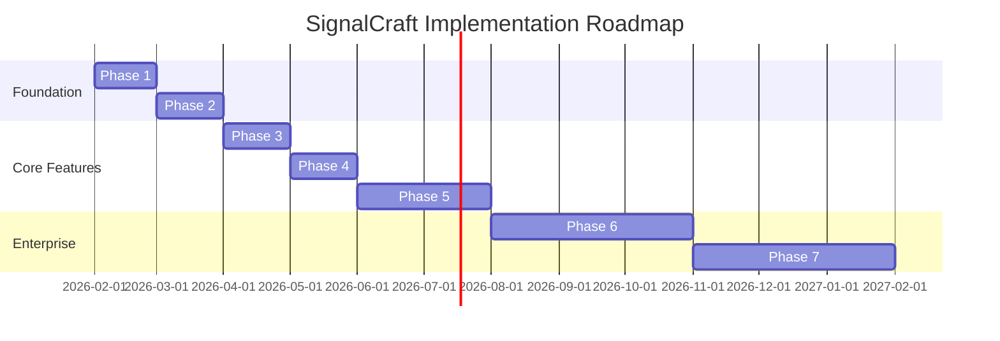

# SignalCraft Advanced Implementation Roadmap

> **Comprehensive 12-month implementation plan** to transform SignalCraft from MVP to enterprise-grade alerting platform

---

## 📋 Overview

This directory contains detailed implementation plans for 7 consecutive phases spanning 12 months. Each phase builds upon the previous, systematically addressing critical gaps identified in the codebase analysis.

**Total Timeline**: 12 months  
**Phases**: 7  
**Total Estimated Effort**: ~2,400 engineering hours

---

## 🗺️ Phase Overview

---

## 📁 Phase Documents

### [Phase 1: Security & Stability](./Phase1_Security_and_Stability.md) 
**Duration**: Month 1  
**Priority**: 🔴 CRITICAL

**Objectives**:
- ✅ Fix SAML signature validation vulnerability
- ✅ Implement WebSocket JWT verification
- ✅ Comprehensive input validation across all endpoints
- ✅ Migrate to AWS Secrets Manager
- ✅ Standardize error handling
- ✅ Add security headers and rate limiting

**Key Deliverables**:
- Zero critical security vulnerabilities
- Secrets management infrastructure
- Security audit passed

**Estimated Effort**: 160 hours

---

### [Phase 2: Testing & Documentation](./Phase2_Testing_and_Documentation.md)
**Duration**: Month 2  
**Priority**: 🟡 HIGH

**Objectives**:
- ✅ Achieve 80% code coverage
- ✅ Integration tests for alert pipeline
- ✅ E2E tests for critical user journeys
- ✅ Frontend testing infrastructure (Vitest)
- ✅ API documentation with Swagger
- ✅ CI/CD pipelines

**Key Deliverables**:
- 50+ unit tests, 20+ integration tests, 10+ E2E tests
- Comprehensive API documentation
- Automated CI/CD pipeline

**Estimated Effort**: 200 hours

---

### [Phase 3: Mobile & Push Notifications](./Phase3_Mobile_and_Push_Notifications.md)
**Duration**: Month 3  
**Priority**: 🟢 MEDIUM-HIGH

**Objectives**:
- ✅ React Native mobile app (iOS + Android)
- ✅ Push notifications via Firebase/APNS
- ✅ SMS fallback (Twilio)
- ✅ Phone call escalation for critical alerts
- ✅ Real-time WebSocket updates
- ✅ Biometric authentication

**Key Deliverables**:
- Mobile apps published to App Store & Google Play
- Push notification delivery < 5 seconds
- Multi-channel escalation working

**Estimated Effort**: 280 hours

---

### [Phase 4: On-Call & Escalations](./Phase4_OnCall_and_Escalations.md)
**Duration**: Month 4  
**Priority**: 🟢 MEDIUM

**Objectives**:
- ✅ On-call rotating schedules
- ✅ Calendar integration (Google Calendar, Outlook)
- ✅ Override management (vacations, swaps)
- ✅ Multi-level escalation policies
- ✅ On-call handoff notes
- ✅ Burnout analytics

**Key Deliverables**:
- Automated rotation generation
- Calendar sync functional
- Escalation policies with 3+ levels

**Estimated Effort**: 240 hours

---

### [Phase 5: Incident Management](./Phase5_Incident_Management.md)
**Duration**: Months 5-6  
**Priority**: 🟢 MEDIUM

**Objectives**:
- ✅ Full incident lifecycle (detect → resolve → learn)
- ✅ Incident timeline & collaboration
- ✅ Slack war room auto-creation
- ✅ Incident roles (Commander, Tech Lead, Comms)
- ✅ Postmortem templates
- ✅ Action item tracking
- ✅ SLA monitoring

**Key Deliverables**:
- Incident management system
- Automated war rooms
- Postmortem generation
- Action item tracking

**Estimated Effort**: 320 hours

---

### [Phase 6: Enterprise & Compliance](./Phase6_Enterprise_and_Compliance.md)
**Duration**: Months 7-9  
**Priority**: 🔵 LOW-MEDIUM

**Objectives**:
- ✅ SOC 2 Type II compliance
- ✅ GDPR compliance & data residency
- ✅ Advanced SSO (Okta, Azure AD)
- ✅ Audit log export to SIEM
- ✅ IP whitelisting
- ✅ Encryption at rest
- ✅ 99.9% uptime SLA
- ✅ Multi-region deployment

**Key Deliverables**:
- SOC 2 certification obtained
- GDPR compliance verified
- Enterprise features deployed
- Penetration test passed

**Estimated Effort**: 480 hours

---

### [Phase 7: Advanced Features](./Phase7_Advanced_Features.md)
**Duration**: Months 10-12  
**Priority**: 🔵 LOW

**Objectives**:
- ✅ ML-powered anomaly detection
- ✅ Auto-remediation workflows
- ✅ Predictive alerting
- ✅ Custom dashboards & widgets
- ✅ Workflow automation (Zapier-like)
- ✅ Integration marketplace
- ✅ Advanced correlation engine
- ✅ AI chatbot for incident response

**Key Deliverables**:
- ML models in production
- Auto-remediation functional
- Custom dashboard builder
- Plugin marketplace launched

**Estimated Effort**: 520 hours

---

## 📊 Success Metrics by Phase

| Phase | Primary Metric | Target |
|-------|---------------|--------|
| Phase 1 | Critical vulnerabilities | 0 |
| Phase 2 | Code coverage | 80%+ |
| Phase 3 | Push notification delivery | < 5 sec |
| Phase 4 | On-call rotation uptime | 100% |
| Phase 5 | Incident MTTA | < 15 min |
| Phase 6 | System uptime SLA | 99.9% |
| Phase 7 | Auto-resolution rate | 30%+ |

---

## 💰 Investment Summary

### Total Estimated Effort
- **Engineering Hours**: ~2,200 hours
- **Team Size**: 3-4 engineers
- **Timeline**: 12 months

### Cost Breakdown (Approximate)

**Infrastructure** (~$5k/month):
- AWS/GCP hosting
- Database (RDS/Cloud SQL)
- Redis
- S3/R2 storage
- Twilio (SMS/Voice)
- Firebase (Push notifications)

**Third-Party Services** (~$3k/month):
- OpenRouter AI
- Clerk authentication
- SOC 2 audit fees
- Security tools
- Monitoring (Datadog/Sentry)

**Total 12-Month Investment**: ~$96k infrastructure + engineering salaries

---

## 🚀 Getting Started

### Prerequisites

Before starting any phase, ensure:
- [ ] Development environment set up
- [ ] Access to all third-party services
- [ ] Team trained on tools and processes
- [ ] Project management system configured
- [ ] Documentation templates ready

### Execution Best Practices

1. **Sequential Phases**: Complete phases in order
2. **Weekly Checkpoints**: Review progress against success metrics
3. **Continuous Testing**: Don't defer testing to Phase 2
4. **Documentation First**: Update docs as features are built
5. **Customer Feedback**: Beta test with real users continuously

---

## 🎯 Priority Recommendations

### Must-Have for Production (Phases 1-3)
These phases are **non-negotiable** before launching to paying customers:
- Phase 1: Security vulnerabilities are show-stoppers
- Phase 2: No tests = production incidents guaranteed
- Phase 3: Mobile alerts are table stakes for this market

### Competitive Requirements (Phases 4-5)
Essential to compete with PagerDuty/Opsgenie:
- Phase 4: On-call management is expected
- Phase 5: Incident management differentiates serious tools

### Enterprise Enablers (Phase 6)
Required for enterprise deals $50k+/year:
- SOC 2 compliance
- GDPR compliance
- 99.9% uptime SLA

### Differentiation (Phase 7)
Innovation that sets SignalCraft apart:
- AI-powered features
- Predictive alerting
- Auto-remediation

---

## 🔄 Iteration Strategy

### MVP Launch (Month 3)
After Phase 3, you can launch to early customers:
- Core alerting works
- Mobile notifications functional
- Security hardened
- Basic tests in place

**Target**: 10-50 early customers, $99-299/month

### Growth Phase (Month 6)
After Phase 5, ready for scale:
- Full incident management
- On-call scheduling
- Enterprise security

**Target**: 100-500 customers, $299-999/month

### Enterprise Ready (Month 9)
After Phase 6, pursue enterprise deals:
- SOC 2 certified
- Multi-region
- Advanced SSO

**Target**: 5-20 enterprise customers, $2k-10k/month

### Market Leader (Month 12)
After Phase 7, compete with incumbents:
- AI differentiation
- Advanced automation
- Rich integration ecosystem

**Target**: 1,000+ customers, Series A fundraising

---

## 📈 Tracking Progress

### Weekly Metrics Dashboard

Track these KPIs weekly:

**Engineering Velocity**:
- Story points completed
- Tests written
- Code coverage %
- Open bugs

**Quality**:
- Critical bugs
- Security vulnerabilities
- Test pass rate
- Performance regressions

**Product**:
- Feature completion %
- Beta user feedback score
- Customer-reported issues
- Feature requests

---

## 🛠️ Tools & Infrastructure

### Required Tools

**Development**:
- GitHub (code repository)
- VS Code / IntelliJ
- Docker Desktop
- Postman / Insomnia

**CI/CD**:
- GitHub Actions
- Docker Hub / ECR
- Railway / Vercel

**Monitoring**:
- Datadog / New Relic
- Sentry
- Logtail / Papertrail

**Collaboration**:
- Linear / Jira
- Slack
- Notion / Confluence

---

## 📚 Additional Resources

### Reference Documentation
- [Original Codebase Analysis](../codebase%20ana.md)
- [Software Vision](../Software_Doc.md)
- [Phase Completion Guide](../../.github/PHASE_COMPLETION_GUIDE.md)

### External Resources
- [SOC 2 Compliance Guide](https://securityscorecard.com/blog/soc-2-compliance-guide)
- [GDPR Checklist](https://gdpr.eu/checklist/)
- [React Native Best Practices](https://reactnative.dev/docs/performance)
- [ML Ops Best Practices](https://ml-ops.org/)

---

## 🤝 Contributing

Each phase document includes:
- ✅ Detailed objectives
- ✅ Implementation steps with code examples
- ✅ Success metrics
- ✅ Timeline estimates
- ✅ Definition of done

When implementing:
1. Read the entire phase document first
2. Break down into smaller tickets
3. Follow code examples as templates
4. Track progress against success metrics
5. Update documentation as you build

---

## 📞 Support & Questions

**For implementation questions**:
- Review the specific phase document
- Check code examples in the document
- Consult original codebase analysis

**For architectural decisions**:
- Review Software_Doc.md for vision
- Check existing patterns in codebase
- Document new patterns in ADRs

---

## ✅ Phase Completion Checklist

Before marking a phase complete:

- [ ] All objectives met
- [ ] Success metrics achieved
- [ ] Tests passing (if Phase 2+ complete)
- [ ] Documentation updated
- [ ] Code reviewed and merged
- [ ] Deployed to staging
- [ ] Beta tested (if applicable)
- [ ] Team trained on new features
- [ ] Runbooks created
- [ ] Retrospective completed

---

## 🎉 Final Notes

This roadmap represents a **comprehensive transformation** of SignalCraft from a functional MVP to an enterprise-grade, AI-powered alerting platform that can compete with established players.

**Key Success Factors**:
1. **Execute phases sequentially** - Don't skip security for features
2. **Customer feedback loops** - Beta test continuously
3. **Quality over speed** - Build it right the first time
4. **Team sustainability** - Avoid burnout with realistic timelines
5. **Document everything** - Future you will thank present you

**Remember**: The goal is not just to build features, but to create a **reliable, secure, scalable platform** that customers trust with their critical production alerts.

Good luck! 🚀

---

*Last Updated: January 2026*  
*Version: 1.0*
